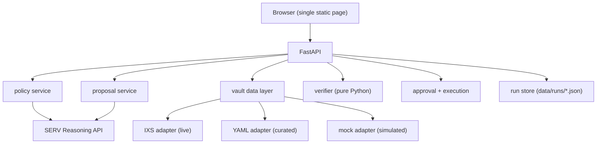

# Bylaw — Your risk policy, enforced.

**Bylaw** is a policy-driven allocator for tokenized real-world-asset (RWA) yield
vaults. You describe your investment constraints in plain language; Bylaw turns them
into a verified allocation, shows you the rationale, and asks for your approval before
doing anything.


---

## Quick start

```bash
# 1. Clone and configure
cp .env.example .env
# Edit .env: set SERV_API_KEY and, optionally, DATA_MODE, SERV_MODEL, BYLAW_PORT

# 2. Build and run
docker compose up --build

# 3. Open the UI  (adjust port if you changed BYLAW_PORT)
open http://localhost:8000
```

Tests (no network or API key required):

```bash
docker compose run --rm app pytest -q
```

---

## Configuration

| Variable | Default | Description |
|---|---|---|
| `SERV_API_KEY` | *(required)* | OpenServ API key |
| `SERV_BASE_URL` | `https://inference-api.openserv.ai/v1` | SERV inference endpoint |
| `SERV_MODEL` | `serv-model-placeholder` | Model name (see [OQ-5](docs/OPEN_QUESTIONS.md)) |
| `DATA_MODE` | `simulated` | `live`, `mixed`, or `simulated` |
| `OFFLINE_DEMO` | `0` | Set to `1` to stub model calls for demos |
| `BYLAW_PORT` | `8000` | Host port for `docker compose up` (change when 8000 is busy) |
| `IXS_MCP_URL` | *(blank)* | IXS MCP endpoint URL |
| `IXS_API_BASE_URL` | *(blank)* | IXS REST API base URL |
| `IXS_VAULT_ID` | *(blank)* | IXS vault identifier |
| `IXS_RPC_URL` | *(blank)* | RPC URL for on-chain reads |
| `LOG_LEVEL` | `INFO` | Python log level |

---

## Architecture



---

## SERV API notes

All calls to the SERV reasoning engine go through `app/serv_client.py`.
One confirmed requirement (discovered 2026-09-19): **every request must include
a system message**. The client wrapper enforces this — callers pass a
`system=` string and the wrapper prepends it; requests without one are rejected
by the API with HTTP 400. A default system message is used when no explicit one
is provided. See [`docs/OPEN_QUESTIONS.md`](docs/OPEN_QUESTIONS.md) FINDING-1.

A second confirmed requirement: **the API uses `max_completion_tokens`, not
`max_tokens`**. Using `max_tokens` returns HTTP 400. The client wrapper uses
`max_completion_tokens` exclusively. See FINDING-3.

A third confirmed requirement: **`temperature` is not accepted**; only the model
default is supported. The client never sends the parameter. See FINDING-4.

---

## How the verifier works — and why the model is not trusted

The SERV reasoning engine **proposes** an allocation and writes a plain-language
rationale. Before the proposal reaches the approval screen it must pass
`app/verifier.py`, a set of pure Python functions with no network calls.

The verifier checks every constraint in the policy against the actual vault snapshot:
weight bounds, no paused vaults, liquidity floor, risk ceiling, APY floor, and
available-liquidity caps. It returns a per-rule pass/fail list. If any rule fails,
the problem list is sent back to the model for a retry (up to 3 attempts total). If
all attempts fail the run ends as `verified: false` and nothing is shown as a
recommendation.

**The model never has the last word.** This is a deliberate design choice: LLMs can
hallucinate numeric values or misread constraints. The verifier is the only thing that
can say "this allocation is valid."

---

## Data sources

Every field on every vault carries a `source` label:

| Label | Meaning |
|---|---|
| `live` | Read from a live API or on-chain at request time |
| `curated` | Human-maintained in `config/vaults.yaml` with an `as_of` date |
| `simulated` | Synthetic data; used for demos and when live data is unavailable |

Simulated data is labeled in the UI banner, in every API response, and in the audit
log. It is never presented as real.

**Risk scores** are not provided by any vault API. They are assigned by the project
team in `config/vaults.yaml` based on three factors: asset class (government bills
score 1–2, investment-grade bonds 2–3, private credit 3–5), redemption speed
(instant redemption reduces the score, multi-week lockups increase it), and chain
maturity. Each entry has an `as_of` date.


