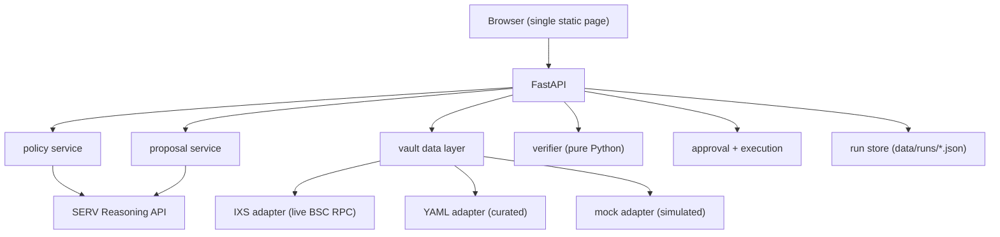

# Bylaw — Your risk policy, enforced.

**Bylaw** is a policy-driven allocator for tokenized real-world-asset (RWA) yield
vaults. You describe your investment constraints in plain language; Bylaw turns them
into a verified allocation, shows you the rationale, and asks for your approval before
doing anything.

> **Hackathon entry** — RWA Vaults track, OpenServ SERV Hackathon Edition 01
> (14–28 September 2026).

---

## Quick start

```bash
# 1. Clone and configure
cp .env.example .env
# Edit .env: set SERV_API_KEY, SERV_MODEL, and optionally BYLAW_PORT

# 2. Build and run
docker compose up --build

# 3. Open the UI  (adjust port if you changed BYLAW_PORT)
open http://localhost:8000
```

Tests (no network or API key required):

```bash
docker compose run --rm app pytest -q
```

---

## Configuration

| Variable | Default | Description |
|---|---|---|
| `SERV_API_KEY` | *(required)* | OpenServ API key |
| `SERV_BASE_URL` | `https://inference-api.openserv.ai/v1` | SERV inference endpoint |
| `SERV_MODEL` | `serv-model-placeholder` | Model name (see [OQ-5](docs/OPEN_QUESTIONS.md)) |
| `DATA_MODE` | `mixed` | `live`, `mixed`, or `simulated`. **`mixed` is recommended** — shows the live IXS vault on BNB Smart Chain alongside simulated peers. Falls back to curated snapshot if the RPC is unavailable. |
| `OFFLINE_DEMO` | `1` | `0` = use real SERV API (recommended for judges). `1` = stub all model calls. **Independent of `DATA_MODE`**: vault data (IXS live RPC) is always fetched regardless of this flag. Tests always force `OFFLINE_DEMO=1` via `conftest.py`. |
| `BYLAW_PORT` | `8000` | Host port for `docker compose up` (change when 8000 is busy) |
| `SERV_MAX_CALLS_PER_RUN` | `10` | Cap on SERV calls per Run |
| `CAPACITY_WARN_SHARE` | `0.10` | Warn when allocation exceeds this fraction of vault TVL |
| `IXS_MCP_URL` | *(blank)* | IXS MCP endpoint URL |
| `IXS_API_BASE_URL` | *(blank)* | IXS REST API base URL |
| `IXS_VAULT_ID` | *(blank)* | IXS vault identifier |
| `IXS_RPC_URL` | *(blank)* | RPC URL for on-chain reads |
| `LOG_LEVEL` | `INFO` | Python log level |

---

## Architecture



---

## SERV API notes

All calls to the SERV reasoning engine go through `app/serv_client.py`.
One confirmed requirement (discovered 2026-09-19): **every request must include
a system message**. The client wrapper enforces this — callers pass a
`system=` string and the wrapper prepends it; requests without one are rejected
by the API with HTTP 400. A default system message is used when no explicit one
is provided. See [`docs/OPEN_QUESTIONS.md`](docs/OPEN_QUESTIONS.md) FINDING-1.

A second confirmed requirement: **the API uses `max_completion_tokens`, not
`max_tokens`**. Using `max_tokens` returns HTTP 400. The client wrapper uses
`max_completion_tokens` exclusively. See FINDING-3.

A third confirmed requirement: **`temperature` is not accepted**; only the model
default is supported. The client never sends the parameter. See FINDING-4.

---

## How the verifier works — and why the model is not trusted

The SERV reasoning engine **proposes** an allocation and writes a plain-language
rationale. Before the proposal reaches the approval screen it must pass
`app/verifier.py`, a set of pure Python functions with no network calls.

The verifier checks every constraint in the policy against the actual vault snapshot:
weight bounds, no paused vaults, liquidity floor, risk ceiling, APY floor, and
available-liquidity caps. It returns a per-rule pass/fail list. If any rule fails,
the problem list is sent back to the model for a retry (up to 3 attempts total). If
all attempts fail the run ends as `verified: false` and nothing is shown as a
recommendation.

**The model never has the last word.** This is a deliberate design choice: LLMs can
hallucinate numeric values or misread constraints. The verifier is the only thing that
can say "this allocation is valid."

**Feasibility check.** Before calling the model, an exact linear-programming check
(scipy HiGHS solver) determines whether *any* allocation can satisfy the policy. If
none can, the model is never called and a plain-language explanation — including the
conflicting rules and a concrete relaxation suggestion — is shown immediately.

---

## Data sources

Every field on every vault carries a `source` label:

| Label | Meaning |
|---|---|
| `live` | Read from a live API or on-chain at request time |
| `curated` | Human-maintained in `config/vaults.yaml` with an `as_of` date |
| `simulated` | Synthetic data; used for demos and when live data is unavailable |

Simulated data is labeled in the UI banner, in every API response, and in the audit
log. It is never presented as real.

**Risk scores** are not provided by any vault API. They are assigned by the project
team in `config/vaults.yaml` based on three factors: asset class (government bills
score 1–2, investment-grade bonds 2–3, private credit 3–5), redemption speed
(instant redemption reduces the score, multi-week lockups increase it), and chain
maturity. Each entry has an `as_of` date. These are **project heuristics**, not
investment ratings or financial advice.

---

## Live vs simulated data (IXS vault)

| Field | Source | Value | Notes |
|---|---|---|---|
| `paused` | **live** | `false` | Read from `paused()` on BSC |
| `available_liquidity_usdc` | **live** | ~654 USDC | `totalAssets()` ÷ 10¹⁸ |
| `asset` | **live** | `USDC` | `asset().symbol()` on BSC |
| `asset_decimals` | **live** | 18 | BSC USDC uses 18 decimals |
| `vault_symbol` | **live** | `ixv1` | |
| `price_per_share` | **live** | ~1.0886 | `pricePerShare()` on BSC |
| `apy` | **curated** | 6.72% *(indicative)* | iShares SHYG 30-day SEC yield, 2026-09-17 |
| `redemption_days` | **curated** | 5 days *(assumption)* | ERC-7540 async, ~3–7 business days |
| `risk` | **curated** | 4 | Project heuristic |

The APY figure is **indicative only** — it is the underlying ETF benchmark yield,
not the vault's realized return. The label "indicative: underlying ETF yield, not
realized by the vault" appears wherever this figure is shown in the UI.
Archive reads on the public BSC RPC fail (`missing trie node`), so trailing vault
yield cannot be derived on-chain. See [`docs/findings.md`](docs/findings.md).

If the IXS RPC is unavailable, the UI shows a prominent banner and falls back to
the last curated snapshot, clearly labeled.

---

## Business model

Bylaw could earn revenue as a managed-allocation SaaS: institutions and DAOs pay a
basis-point fee on assets under management, or a monthly subscription for the
compliance-audit trail. A white-label SDK licensed to vault operators is a second
revenue stream. The verifier's deterministic, auditable output is the key
differentiator — allocations are explainable and regulator-friendly.

---

## Known limitations

- In `simulated` mode, vault data is synthetic. Do not use it for real investment
  decisions.
- Execution is dry-run only. The app produces a labeled simulated execution report;
  no transactions are submitted and no private keys are ever handled.
- The IXS vault TVL is ~654 USDC (likely an early/testnet deployment). The default
  100,000 USDC demo budget vastly exceeds it; a capacity warning is shown.
- IXS APY is an indicative benchmark figure, not realized vault yield.
- SERV model names depend on the API key tier; see [OQ-5](docs/OPEN_QUESTIONS.md).

---

## Demo script

See [`docs/DEMO.md`](docs/DEMO.md).

---

## Human-only submission tasks

1. Enable data collection in the OpenServ console organisation settings (eligibility
   requirement).
2. Publish the public X post: project name, concept, images, links (GitHub, demo),
   tag `@openservai`.
3. Fill in the official submission form after posting.
4. Submit before **28 September 2026 00:00 UTC**.

---

## Open questions

See [`docs/OPEN_QUESTIONS.md`](docs/OPEN_QUESTIONS.md).

---

*Last updated: 2026-09-21.*
